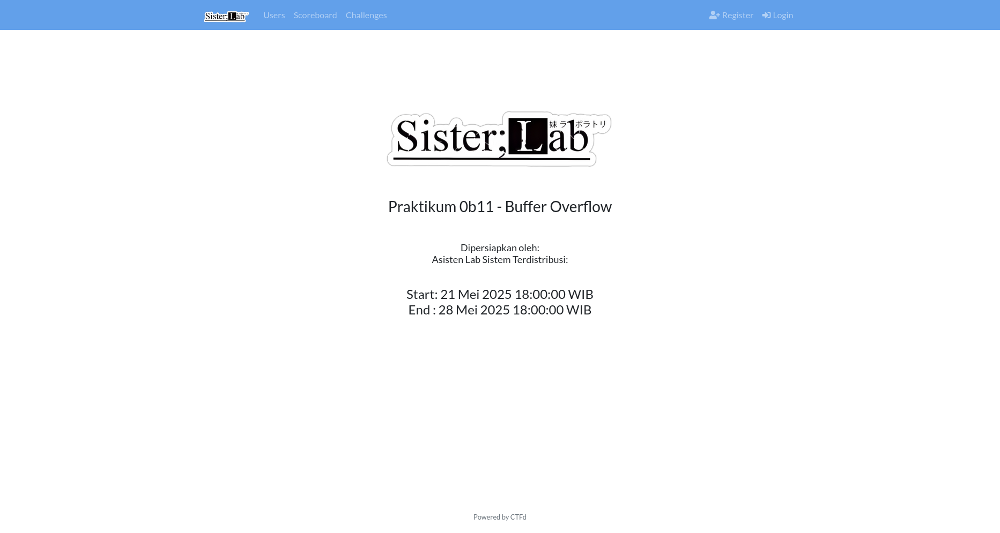

# Praktikum 0b11 Orkom - Buffer Overflow



Welcome to the **Buffer Overflow Practical Module** for the **IF1230** course at _Institut Teknologi Bandung_ (ITB), academic year **2024–2025**.

This module introduces the internal workings of programs and processes in the Linux architecture, featuring:

- A short theoretical introduction
- 1 simple buffer overflow example
- 6 main challenges
- 3 bonus challenges
- 1 final boss challenge

Each challenge is containerized for easy deployment and comes with a corresponding solver in its `writeup/` directory.

---

## 🧠 Introduction

You can find the introductory material in this [PDF document](docs/introduction.pdf), which covers essential concepts including Linux internals, memory layout, and buffer overflow fundamentals.

- [Examples and Concepts](examples/)

## 📘 Simple Example

- [Aleph](praktikum/aleph/) — [Solver](praktikum/aleph/writeup/)

## 🔥 Main Challenges

- [Balterie](praktikum/balterie/) — [Solver](praktikum/balterie/writeup/)
- [Catastravia](praktikum/catastravia/) — [Solver](praktikum/catastravia/writeup/)
- [Daosdorg](praktikum/daosdorg/) — [Solver](praktikum/daosdorg/writeup/)
- [Judradjim](praktikum/judradjim/) — [Solver](praktikum/judradjim/writeup/)
- [Medrozobalt](praktikum/medrozobalt/) — [Solver](praktikum/medrozobalt/writeup/)
- [Nephtear](praktikum/nephtear/) — [Solver](praktikum/nephtear/writeup/)

## 💎 Bonus Challenges

- [Reamstroha](praktikum/reamstroha/) — [Solver](praktikum/reamstroha/writeup/)
- [Reelseiden](praktikum/reelseiden/) — [Solver](praktikum/reelseiden/writeup/)
- [Waldgose](praktikum/waldgose/) — [Solver](praktikum/waldgose/writeup/)

## 👑 Boss Challenge

- [Zoltraak](praktikum/zoltraak/) — [Solver](praktikum/zoltraak/writeup/)

---

## 🚀 Running the Challenges Locally

To start a challenge on your local machine:

1. Make sure you have a container engine installed, such as **Docker** or **Podman**.
2. Navigate to the challenge directory.
3. Run `docker compose up --build -d --force-recreate` to build or update and launch the environment.

Example:

```bash
cd praktikum/balterie
docker compose up --build -d --force-recreate
```

---

## 👨‍💻 Developers & Contact

This module was developed by the IF1230 Teaching Assistant Team, consisting of lab assistants from the Distributed Systems Lab year 2021, along with other contributors from Institut Teknologi Bandung.

For inquiries or technical issues, feel free to contact us via 📧 labsister@std.stei.itb.ac.id.
